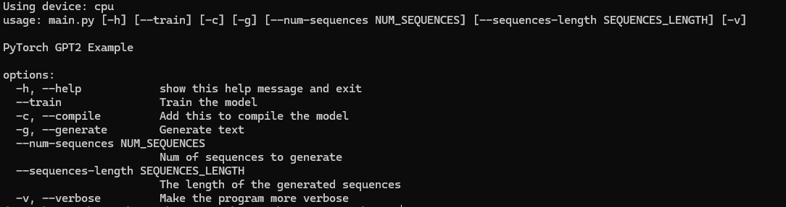

# spoon-gpting

## Description

This project contains a reproduction of the GPT2 model.

Structure:

```bash
.
├── README.md
├── LICENSE
├── requirements.txt
├── .gitignore
├── setup_Linux.sh
├── setup_Windows.bat
├── data
│   ├── book.txt
│   ├── input.txt
│
├── bin
│   ├── main.py
│   ├── model.py
│   ├── fineweb.py
│   ├── data_managment.py
│   ├── test_model.py
│   ├── tokenizer.py
│   ├── read_parquet.py
```

## Note

The input data for the training must be a parquet file: title,text. The data must be in the `data` folder.

## Improvements

- [X] Add a way to evaluate the model with a test set
- [ ] Add a web interface to interact with the model
- [ ] Connect data_managment.py to a database to store the data
- [ ] Improve the generation of the text with different type of generation (greedy, beam search, top-k, top-p)
- [ ] Add a way to finetune the model with new data
- [ ] Use a custom tokenizer

## Requirements

python >= 3.9

To run the project, you need to have Python installed on your machine. You can download Python from the [official website](https://www.python.org/downloads/)

**Setting Up the Environment**

* Windows: `./setup_Windows.bat`
* Linux/macOS: `./setup_Linux.sh`

These scripts will install required dependencies, and build a virtual environment for you if you don't have one.

## Usage

Before running the application, you need to insert the text you want to use as input in the `data/input.txt` file.
Run the following command to start the application:

```bash
cd bin
python ./main.py [--help]
```



## License

This project is licensed under the MIT License - see the [LICENSE](LICENSE) file for details.

## Author

[Neetre](https://github.com/Neetre)
